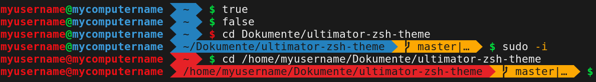
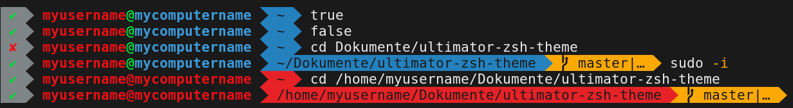

# Ultimator Theme for Zsh
Agnoster like theme for zsh.  
Set `ZSH_THEME="ultimator"` to activate.

Set `ZSH_THEME="ultimator2"` for return status in the beginning.

## Requirements
- A [Powerline](https://github.com/powerline/fonts) patched font
- [Zsh-git prompt](https://github.com/Ultimator14/zsh-git-prompt)
